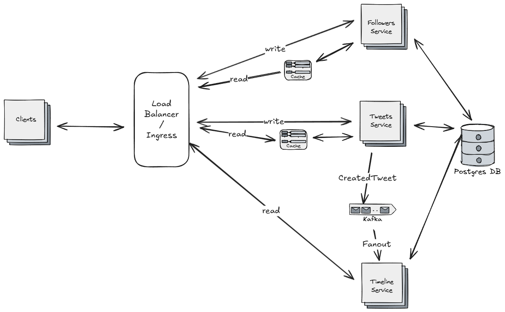
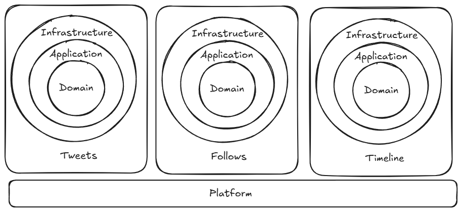

# Twitter-like Microblogging Platform

Plataforma de microblogging inspirada en Twitter, desarrollada como parte de un challenge técnico.  

## Objetivo
- Publicar **tweets** (mensajes de hasta 280 caracteres).
- Seguir y dejar de seguir a otros usuarios.
- Visualizar un **timeline paginado** con tweets de usuarios seguidos.

## Arquitectura

- Se tuvieron en cuenta **supuestos de negocio** en [business.txt](business.txt).

### Diagrama de Sistema


### Arquitectura de Código
Más detalles en el ADR: [ADR-CODE-ARCHITECTURE.md](docs/adr/ADR-CODE-ARCHITECTURE.md)



**Componentes principales:**
- **Tweets:** Maneja el dominio de tweets, publicación y obtención de mensajes.
- **Follower:** Gestiona las relaciones de follow/unfollow.
- **Timeline:** Construye y expone el timeline de cada usuario a partir de eventos de tweets.

## Instalación y Ejecución

### Prerequisitos
 - Java 17+
 - Maven 3.8+
 - Quarkus 3.26.3
 - Docker + Docker Compose (para PostgreSQL, Redis y Kafka)

### 1.Clonar el repositorio
```
git clone https://github.com/leacapello/backend-challenge
cd backend-challenge
```
### 2.Contruir Jar
```
./mvnw clean package
```

### 3.Levantar dependencias externas
```
docker-compose up
```

### 4.Ejecutar la aplicación
```
java -Duser.timezone=UTC -jar target/quarkus-app/quarkus-run.jar
```

## Documentación y Observabilidad
Una vez la app esté arrriba:
 - Swagger UI: http://localhost:8080/q/swagger-ui/
 - Health Checks: http://localhost:8080/q/health
 - Métricas Prometheus: http://localhost:8080/q/metrics

## Testing
Ejecutar todos los tests:
```
./mvnw test
```

## Documentación Adicional
 - [business.txt](business.txt)
 - [ADRs (Architecture Decision Records)](docs/adr)
